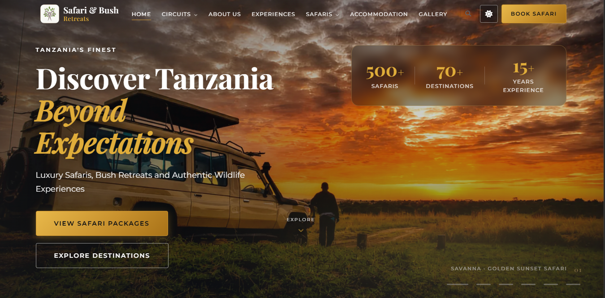
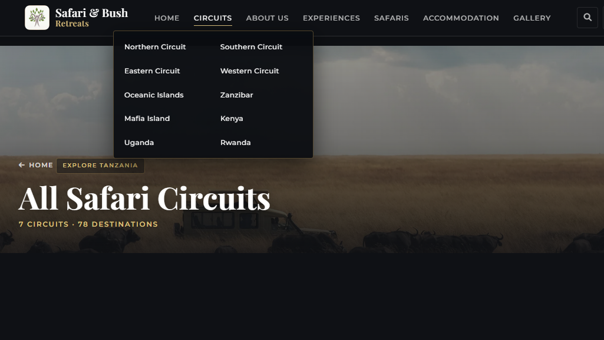
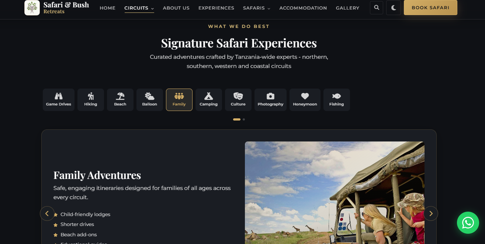
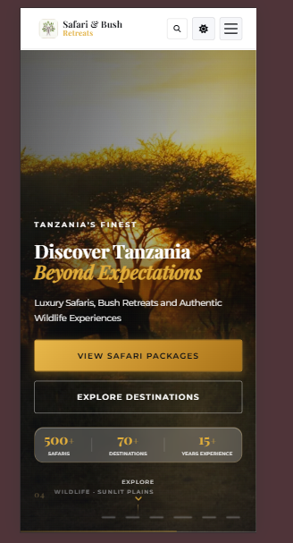
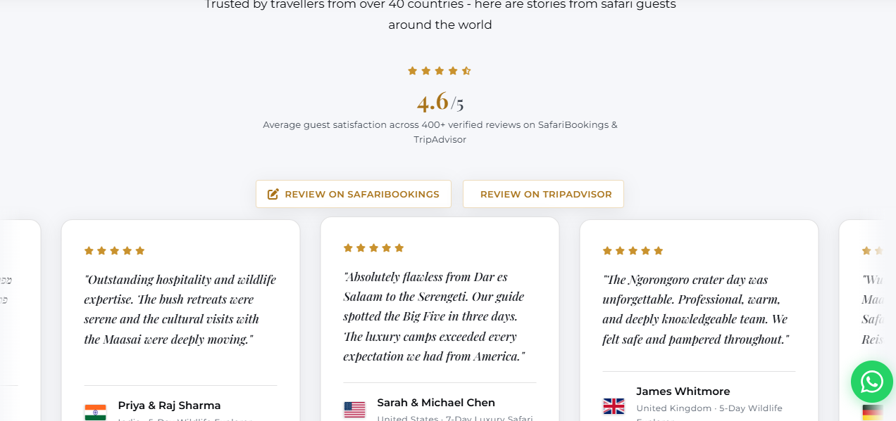
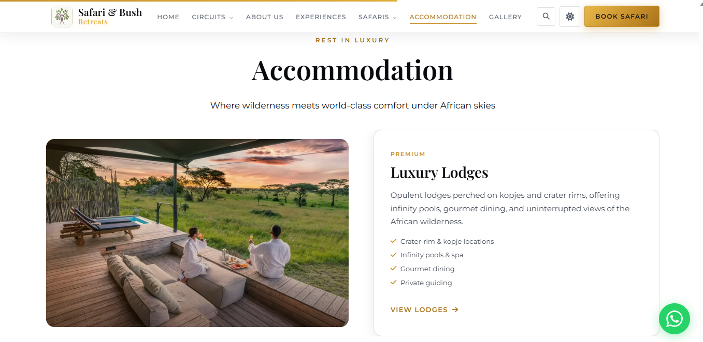

# Safari and Bush Retreats

**Live site:** [safariandbushretreats.com](https://safariandbushretreats.com)  
**Contact:** [info@safariandbushretreats.com](mailto:info@safariandbushretreats.com) · WhatsApp +255 768 373 033

---

## Landing page

Add your own captures under `docs/screenshots/` (suggested filenames below). Replace the paths once files are in place.

| Hero slideshow | Destinations carousel | Experiences & booking |
| --- | --- | --- |
|  |  |  |

| Mobile home | Testimonials | Dark / light theme |
| --- | --- | --- |
|  |  |  |

**Suggested screenshot files**

- `docs/screenshots/landing-hero.png` – first slide (safari vehicle at sunset)
- `docs/screenshots/landing-destinations.png` – `#destinations` swiper
- `docs/screenshots/landing-experiences.png` – `#experiences` auto-rotating activity panel
- `docs/screenshots/landing-mobile.png` – phone width, nav closed
- `docs/screenshots/landing-testimonials.png` – `#testimonials` section
- `docs/screenshots/landing-theme.png` – same view in light mode

---

## What this repo is

A static marketing and booking site for **Safari and Bush Retreats**, a Tanzania-based safari operator. The site is built to feel like a proper travel brand site, not a template: hero slideshow, circuit-based navigation, 150+ safari packages, partner lodge pages, and a contact form that works on static hosting.

Content spans **Tanzania** (seven circuits, national parks, Zanzibar, Mafia), plus **Kenya**, **Uganda**, and **Rwanda** hubs. Pages are mostly generated from JSON in `data/` so you can refresh copy and images without hand-editing hundreds of HTML files.

There is no Node build step for the public site. Python scripts maintain pages, images, and SEO files. The browser loads plain HTML, CSS, and vanilla JS with self-hosted fonts, Font Awesome, and Swiper.

---

## Tech at a glance

| Layer | Choice |
| --- | --- |
| Pages | Static HTML (~320 files) |
| Style | `css/style.css`, `theme.css`, `responsive.css`, `performance.css` |
| Behaviour | `js/main.js`, `experiences-showcase.js`, `site-config.js` |
| Data | JSON in `data/` (destinations, packages, accommodations, search index) |
| Images | Local assets + WebP variants in `assets/images/opt/` |
| Analytics | Google Tag Manager (`data/site-config.json` → `gtmContainerId`) |
| Forms | [FormSubmit.co](https://formsubmit.co) → `info@safariandbushretreats.com` |
| Hosting target | Cloudflare Pages (or any static host) |

---

## Project layout

```
safari bush/
├── index.html              # Homepage (hero, destinations, packages, gallery, booking)
├── about.html              # Team story & Life on Safari gallery
├── sitemap.xml             # 315+ URLs (built from site-config domain)
├── robots.txt
├── assets/images/          # Photos, WebP opt/, favicon
├── css/                    # Stylesheets
├── js/                     # Front-end logic
├── data/                   # Source JSON + site-config.json
├── destinations/           # Park & place detail pages
├── safaris/                # Individual package pages
├── circuits/               # Circuit hub pages (Northern, Southern, etc.)
├── accommodations/         # Lodge & camp partner pages
├── categories/             # Safari type listings
├── kenya/ uganda/ rwanda/  # Country destination hubs
├── vendor/                 # Self-hosted fonts, FA, Swiper
└── scripts/                # Build & deploy tooling (do not publish to CDN root)
```

**Single source of truth for site-wide settings:** `data/site-config.json`

```json
{
  "siteUrl": "https://safariandbushretreats.com",
  "siteName": "Safari and Bush Retreats",
  "contactEmail": "info@safariandbushretreats.com",
  "gtmContainerId": "GTM-…"
}
```

After changing domain, email, or GTM id, run the matching patch script (see below).

---

## Run locally

From the project root:

```bash
npx serve .
```

Open `http://localhost:3000` (or the port `serve` prints). Hash links like `#bookingForm` and `#destinations` work on the homepage.

**Requirements for scripts:** Python 3.10+ and Pillow (`pip install pillow`) for image optimization.

---

## Deploy to Cloudflare Pages

1. Connect this GitHub repo to Cloudflare Pages.
2. **Build command:** leave empty (static site).
3. **Build output directory:** `/` (repository root).
4. **Exclude from upload** (recommended): `scripts/`, `.git/`, `.cursor/`  
   `data/` can stay if you rely on `search-index.json` in the browser; `robots.txt` already asks crawlers not to index `/data/`.

Before each production push:

```bash
python scripts/pre-deploy-check.py
```

Fix anything it reports, then commit and push. Cloudflare will serve the new files.

**Post-deploy**

- Submit `https://safariandbushretreats.com/sitemap.xml` in Google Search Console.
- Confirm GTM fires on the live domain (Tag Assistant or GTM Preview).
- Submit the booking form once so FormSubmit verifies `info@safariandbushretreats.com`.

---

## Scripts you will actually use

| Command | When |
| --- | --- |
| `python scripts/prepare-deploy.py` | Full pipeline before a big release |
| `python scripts/pre-deploy-check.py` | Quick gate: links, favicon, GTM placeholder |
| `python scripts/build-sitemap.py` | Regenerate `sitemap.xml` after adding pages |
| `python scripts/build-robots.py` | Regenerate `robots.txt` after domain change |
| `python scripts/build-search-index.py` | Refresh site search JSON |
| `python scripts/patch-gtm.py` | Push GTM id from `site-config.json` into all HTML |
| `python scripts/optimize-images.py` | New JPG/PNG → WebP in `assets/images/opt/` |
| `python scripts/enhance-html-images.py` | Add `<picture>` / `srcset` to HTML |
| `python scripts/generate-all.py` | Regenerate destinations, safaris, circuits, etc. |

`prepare-deploy.py` runs, in order: setup assets → generate pages → optimize images → enhance HTML → GTM → search index → sitemap → robots.

---

## Content workflow

1. Edit JSON in `data/` (`tanzania-core.json`, `safari-packages.json`, `accommodations.json`, etc.).
2. Run the relevant generator, e.g. `python scripts/generate-destinations.py` or `generate-all.py`.
3. Drop new images in `assets/images/` (or `assets/images/external/…`).
4. Run `optimize-images.py` then `enhance-html-images.py` for new photos.
5. Run `build-sitemap.py` if URLs changed.
6. `pre-deploy-check.py` → commit → push.

**Homepage-only edits** (hero copy, stats, testimonials) live in `index.html`. Hero slide 1 uses `assets/images/slideshow-main.png`.

---

## Homepage numbers (hero stats)

Configured in `index.html` on the hero glass card:

- **500+** Safaris  
- **70+** Destinations  
- **15+** Years experience  

Counters animate via `data-count` attributes in `js/main.js`.

---

## SEO & discovery

- Canonical domain: `https://safariandbushretreats.com`
- `sitemap.xml` – all public HTML routes
- `robots.txt` – allows `/`, blocks `/scripts/`, `/data/`, `404.html`
- Schema.org `TravelAgency` on the homepage
- Open Graph / Twitter cards on `index.html`

---

## GitHub

```bash
git add -A
git commit -m "Describe your change"
git push -u origin main
```

Remote: `https://github.com/albert-victor/Safari-retreat.git`

---

## Licence & assets

Site copy and branding belong to Safari and Bush Retreats. Some images are mirrored from Tanzania Tourism, partner lodges, or Unsplash; check `data/image-registry.json` and `assets/image-manifest.json` for paths. Do not reuse partner or scraped images outside this project without permission.

---

*Real guides · Real bush · No middlemen.*
